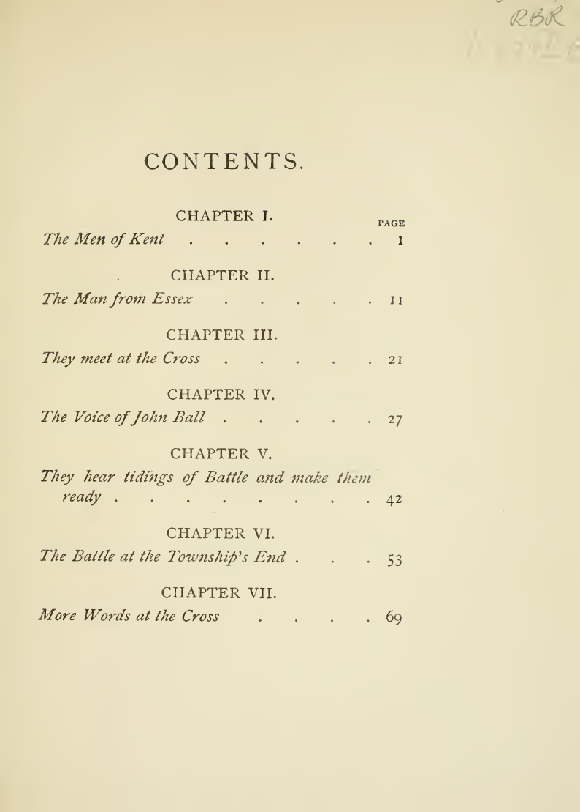
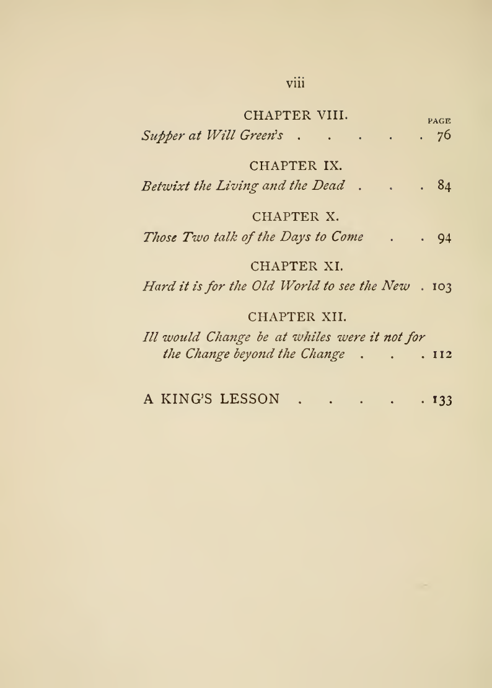
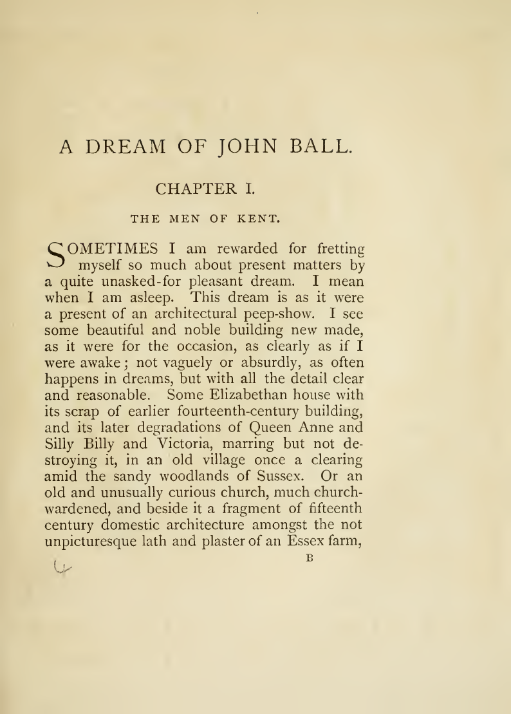
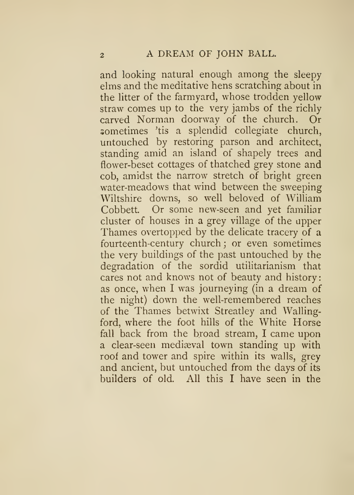

# William Morris — *A Dream of John Ball; and, A King's Lesson*

This directory is a Blackball primary-source corpus and a small human-readable reading room.

The retrieval goal is to keep a searchable proofread transcription beside the historical page-image scan and raw scan OCR, while also exposing enough of the actual typography that a human reader can recognize that this is a book rather than another metadata record.

## Why this source is here

William Morris's *A Dream of John Ball* is a useful primary-source companion to E. P. Thompson's work on Morris. Published in book form in 1888, it imagines a modern socialist entering the world of the 1381 English rising and talking with John Ball about fellowship, class, wage labour, dispossession, machinery, markets, historical defeat, and what later generations may make of a defeated revolt.

For a recursive Thompson source graph, Morris should therefore exist as an inspectable source rather than only as a name in Thompson's bibliography.

## Read / inspect locally

- [1888 page-image scan PDF](./internet-archive/dreamofjohnballa00morr/dreamofjohnballa00morr.pdf) — local copy of Internet Archive item `dreamofjohnballa00morr`;
- [complete Project Gutenberg-derived reading text](./a-dream-of-john-ball-and-a-kings-lesson-gutenberg-reading-copy.txt) — cleaner search/read representation;
- [Internet Archive raw OCR text](./internet-archive/dreamofjohnballa00morr/dreamofjohnballa00morr_djvu.txt) — scan-derived OCR, deliberately kept distinct from the proofread reading text;
- [Internet Archive metadata snapshot](./internet-archive/dreamofjohnballa00morr/metadata-api.json);
- [source-file SHA-256 checksums](./internet-archive/dreamofjohnballa00morr/SHA256SUMS);
- [page-image checksums](./page-images/SHA256SUMS).

## A few actual pages

These PNGs are extracted directly from the local 1888 scan, not recreated typography:

- `contents-1.png` and `contents-2.png` — the two contents pages;
- `chapter-1-page-1.png` and `chapter-1-page-2.png` — the first two pages of chapter I, “The Men of Kent.”

  
  

  
  

The images were rendered from the page-image PDF at 150 dpi. They are convenience derivatives; the PDF remains the archival page representation.

## Historical source route

- Internet Archive item: https://archive.org/details/dreamofjohnballa00morr
- original direct PDF: https://archive.org/download/dreamofjohnballa00morr/dreamofjohnballa00morr.pdf
- Wikimedia Commons record of the same public-domain scan: https://commons.wikimedia.org/wiki/File:A_dream_of_John_Ball_;_and,_A_king%27s_lesson_(reprinted_from_the_%27Commonweal%27)_(IA_dreamofjohnballa00morr).pdf

A reader who wants the physical page can use the local PDF or the extracted page images. A model that wants search-friendly text should normally start with the local Gutenberg-derived TXT and check page-sensitive wording against the local scan. The raw IA OCR is useful when the relation between scan and OCR itself matters.

## Project Gutenberg provenance

- ebook 357: https://www.gutenberg.org/ebooks/357
- source work: William Morris, *A Dream of John Ball; and, A King's Lesson*.

The local reading TXT is derived from Gutenberg #357. It preserves the complete Morris literary text, but it is not represented as a byte-for-byte archival mirror of Gutenberg's current distribution package; use Gutenberg itself for its current packaging and terms.

## Rights

The work was published in 1888 and is public domain in the United States. Wikimedia Commons identifies this scan as a mechanical scan of a public-domain original. That is why Blackball can preserve the complete literary text, scan PDF, raw OCR, and page-image derivatives locally.

This rule should not be generalized to a twentieth-century book merely because Internet Archive exposes a lending or preview record.

For future public-domain/open-license corpora, prefer the same bundle when available: searchable proofread text, raw scan OCR, page-image PDF, table of contents, a couple of opening pages, checksums/provenance, and an explicit distinction between source scans and derived convenience representations.
